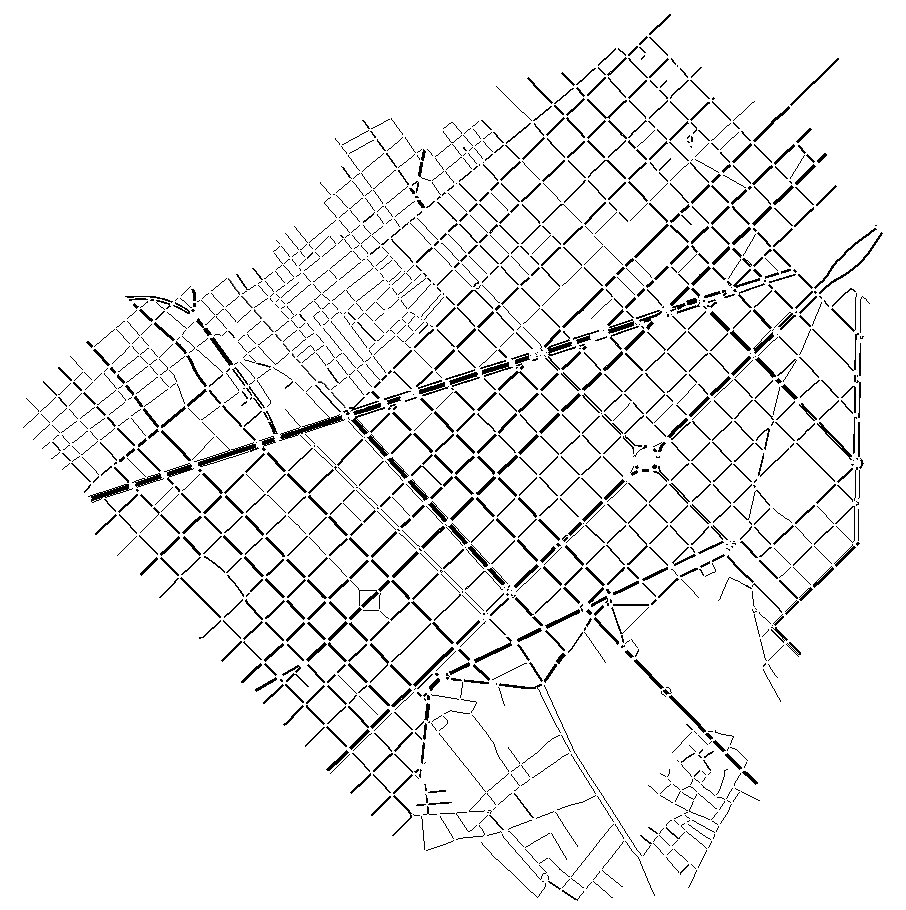
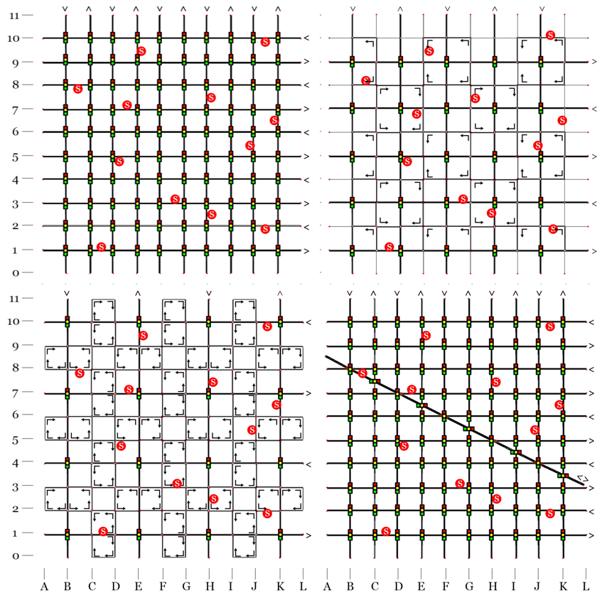

# CoCi-MooC-SUMO-scenarios
CoCi MooC SUMO scenarios

This repository stores the scenarios covered by the video lectures Do-It-Yourself for the CoCi MooC.

## Scenario_01
Basic scenario for running a simple SUMO simulation.
The simulated area corresponds to the core of the city of Barcelona (Eixample district) with network created based on OSM data.
Routes are estimated from Activitygen based on sociodemographic data of the simulated area.
For execution it is needed only to run the bash file *scenario_001.sh*

<i>
<b>Net for Scenario 1.</b> Section of the core of the city of the Barcelona, centered in the Eixample district.
</i>

## Scenario_02
Set of 4 different networks for comparing alternative scenarios as an extended A/B testing.
These 4 networks are abstractions and simplifications of an area of 9x9 blocks of the Eixample district of Barcelona, which is equivalent roughly to 1.44km2. outes are estimated from Activitygen based on sociodemographic data of the simulated area.
Each alternative needs to be run separately for obtaining the results. A script is provided for visualization and comparison of results.

<i>
<b>Net for Scenario 2.</b> Top left: alternative 1, baseline, regular grid. Top right: alternative 2, 2x2 superblocks pattern, based on original Cerdá's plan for Barcelona. Bottom left: alternative 3, 3x3 superblocks pattern, based on existing plan for Barcelona (Rueda, S. 2018). Bottom right: alternative 4, regular grid with a diagonal avenue, closer to the actual layout currently found in the city.
</i>

## Requirements
For running these simulations, **SUMO** framewok needs to be installed: https://sumo.dlr.de/docs/index.html

Additionally, the following tools are needed:
- Bash shell.
- Python 3.x (libraries: numpy, pandas, matplotlib).
- Jupyter Notebook for visualization (in scenario 2).